# Application of High-level micro-stepping motor
## Important matters
**This project was jointly completed by @benson20010606 and  Zhiqiang Wang**  
**The controller program is modified based on the STMicroelectronics sample program.**

## Introduce
This research project uses the STM32F401RE development board, the IHM02A1 motor driver board, and C# as the development platform. The program is flashed onto the STM32F401RE and an operation interface is written in C# to achieve Human-Machine Interface (HMI) implementation. The operation interface allows control of the stepper motor. The actions controlled by the user are encoded and transmitted to the STM32F401RE via UART. The development board then decodes the commands and issues them to the driver board via SPI, enabling multi-axis stepper motor control.  

## HARDWARE
### NUCLEO-F401RE

   
Equipped with mbed functionality and supporting Arduino interfaces, it also provides ST Morpho extension headers, which can connect to all peripheral external devices of the microcontroller. The Arduino connectivity enables this development board to utilize Arduino expansion features, allowing developers to easily and quickly add special functionalities. This development board also provides comprehensive support for the STM32 series, enabling developers to flexibly prototype designs and dynamically fine-tune software and hardware at various stages of development. The development board integrates ease of use, flexibility, connectivity, and mainstream tool resources, making it one of the ideal development boards for developers.  

  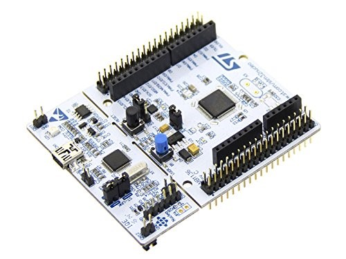

### STM32 F401RCT6 CORE BOARD

Compared to the STM32F401RE, which uses the same MCU and functionalities, the flashing method for this board utilizes JTAG. Although this flashing method is more complex than that of the STM32F401RE, it offers the advantage of a smaller size, making it more suitable for system integration and reducing the space required.  

  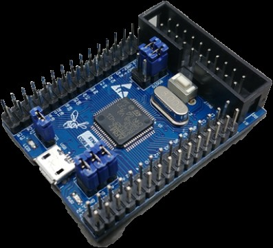

  

### X-NUCLEO-IHM02A1
 
The X-NUCLEO-IHM02A1 is a two axis stepper motor driver expansion board based on the L6470. It provides an affordable and easy-to-use solution for low voltage motor control driving for stepper motors in your STM32 Nucleo project.  

The L6470PD is the main driver chip for the two-axis driver board x-nucleo-ihm02a1. Its primary function is to send pulse signals to control stepper motors. This chip provides an operating voltage of 8-45V, 128 microstep capability, step loss detection, programmable speed profiles, and positioning capability. It also features an SPI module, good power efficiency, and over-temperature protection. Paired with the STM32F401RE development board, it can control up to 8 stepper motors, making it suitable for various applications in multi-axis motor control development.  

  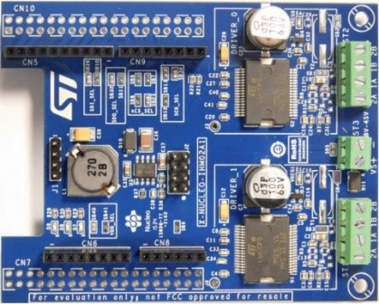

### optical interrupter

An optical interrupter is a type of sensor with internal components that include an emitter and a receiver placed opposite each other within the same package. When an object passes through the optical interrupter, it interrupts the light path between the emitter and the receiver. If the receiver detects light, it triggers a transistor to maintain a stable state; when no light is detected, it generates a signal. This method is used to achieve the detection function of the optical interrupter.  

In this project, the signal generated by the optical interrupter is used to detect whether a motor exceeds its working range. If the detection point triggers the optical interrupter, the STM32F401RE development board immediately receives the signal and stops the stepper motor from continuing to move.    

  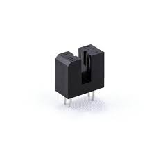

### optocoupler

An optocoupler is a device that uses light (including visible light and infrared) as a medium to transmit electrical signals between input and output circuits. Its function is to normally isolate the input circuit from the output circuit, and to allow electrical signals to pass through the isolation layer when needed. Optocouplers enable signal transmission between two electrically isolated circuits, ensuring that high voltages between these circuits do not affect each other.  

In this project, the ILQ620GB optocoupler is used as an isolation for limit switch signals. It features 4 sets of optically isolated switches designed for electrical isolation. Its primary function is to block high voltages and voltage transients, preventing these transient voltages from affecting other parts of the circuit.    

  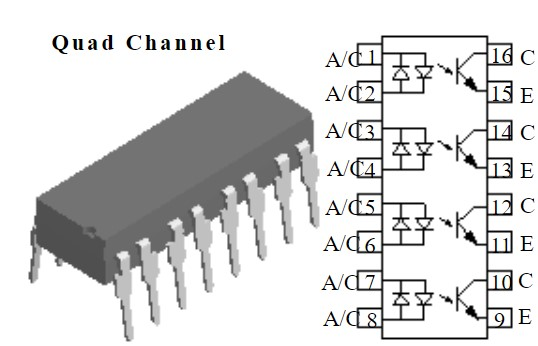

  

### Stepper motor
 
A stepper motor is a type of brushless DC electric motor characterized by a stator and rotor with teeth-like projections that interlock. It rotates in discrete steps by switching the direction of current in the stator coils. Stepper motors operate using open-loop control and are triggered by pulse signals to switch currents. They do not require feedback devices for position or speed detection. This allows stepper motors to rotate precisely in proportion to the pulse signals, achieving accurate position and speed control with high stability.  

  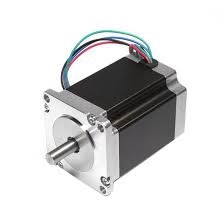  

## Introduction to User Interface and Its Functions
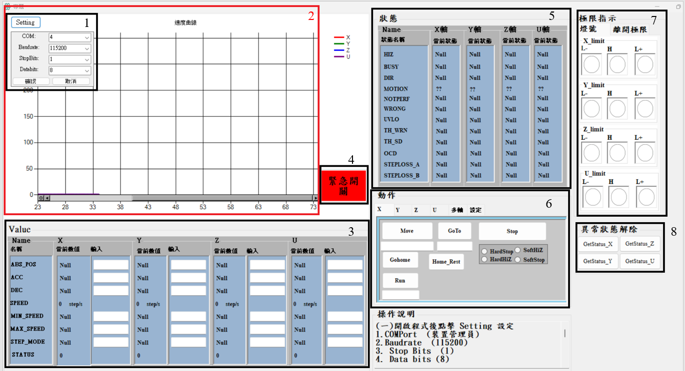

### 1.UART connect
Set the baud rate, data bits, stop bits, parity, and COM port for communication with a microcontroller board.  

### 2.Motor Velocity plot
Real-time reading of the speed information of each axis motor from the registers and visualizing it into a chart.  

### 3.Reading and Changing Parameters
Read data from the registers through commands.
#### ABS_POS
The ABS_POS register contains the current motor absolute position in agreement with the selected step mode ; the stored value unit is equal to the selected step mode. The value is in 2's complement format and it ranges from $-2^{21}  to  +2^{21}-1$.  
#### ACC
Set acceleration (unit: $step/s^2$),after converting the format(unit: $step/tick^2$), transfer it into the  ACC register. 
$$\left[ step/s^2 \right] = \frac{ACC \cdot 2^{-40 }}{tick^2}$$

#### DEC
Set deceleration (unit: $step/s^2$),after converting the format(unit: $step/tick^2$), transfer it into the  DEC register.  

$$\left[ step/s^2 \right] = \frac{DEC \cdot 2^{-40 }}{tick^2}$$

#### SPEED
read the current speed( $step/s$) Form SPEED $step/tick$ register.  
$$\left[ step/s \right] = \frac{SPEED\cdot 2^{-28 }}{tick}$$
#### MAX_SPEED
Set the speed maximum limit .  

#### MIN_SPEED
Set the speed minimum limit .  

#### STEP_MODE

Selects one of eight possible stepping modes: Full-step、Half-step、1/4 microstep、1/8 microstep、1/16 microstep、1/32 microstep、1/64 microstep、1/128 microstep.
 
#### STATUS

Based on the status register , you can obtain information about the current operation of the motor to facilitate troubleshooting.

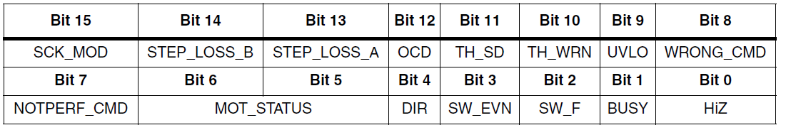

### 4.Emergency stop
Force the motor to stop.

### 5.status retrieval
Detailed information corresponding to the status register.

### 6.motion control

#### 6.0 Single-axis motion control

Run: Sets the target speed and the motor direction
Move:Makes N_STEP (micro)steps in DIR direction
Goto:Brings motor into ABS_POS position (minimum path)
GoHome:Brings the motor into HOME position
Stop:Stops motor with different status
Home Reset:Perform homing using the optical limit switch.

#### 6.1 Multi-axis simultaneous motion control

    

#### 6.2 Reset 
Set the homing direction and position.

    

### 7.LIMIT  control
Use the optical limit switch and interrupts to prevent the motor from exceeding its operating range.

    

### 8.abnormal state resolution

When an abnormal state occurs, the motor will stop forcibly. After troubleshooting based on the status, use this function to confirm that the issue has been resolved and resume normal operation.  

## Circuit Test
### Two-axis circuit testing
Before designing the circuit using Altium Designer, some functions of the original driver board were not used. After research and discussion, it was decided to remove certain circuits to simplify both the circuitry and cost. The driving circuit was then soldered using a phenolic board and an IC adapter board, followed by testing.

After soldering the circuit, it was discovered that an abnormal indicator light on the driver board occasionally lit up. By checking the abnormal status table through the C# interface, it was found that there was insufficient power supply. Upon inspection, it was discovered that there was poor contact at the power supply connection of the soldered circuit. After correcting this issue, all functions were able to be used normally, and it was possible to perform multi-axis control in conjunction with the original driver board.  

  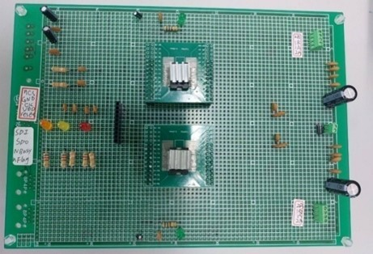  

### Four-axis circuit 

or this project, the PCB for the four-axis stepper motor driver utilizes the Gerber files from the X-NUCLEO-IHM02A1 as a reference for design. The control circuit incorporates the STM32F401RCT6 CORE BOARD into the design of the lower board and integrates it with the stepper motor driving circuit. Additionally, the configuration of the ARCUS four-axis motor axis card's upper and lower boards is referenced. The stepper motor output lines and limit switch connections, as well as status and power indicator lights, are routed from the upper board. The upper and lower boards are connected using pin headers and sockets.

Due to the use of a milling machine for PCB engraving, vias in the TOP layer and BOTTOM layer require soldering to ensure continuity. Special planning was done for the via design to avoid potential issues with the circuit's functionality later on.

Since the limit switch's power and trigger voltage requirements do not match the system's power supply, optical isolation is needed for electrical isolation. Therefore, an optical isolation circuit was added to the upper board to ensure the proper functionality of the limit switch.

  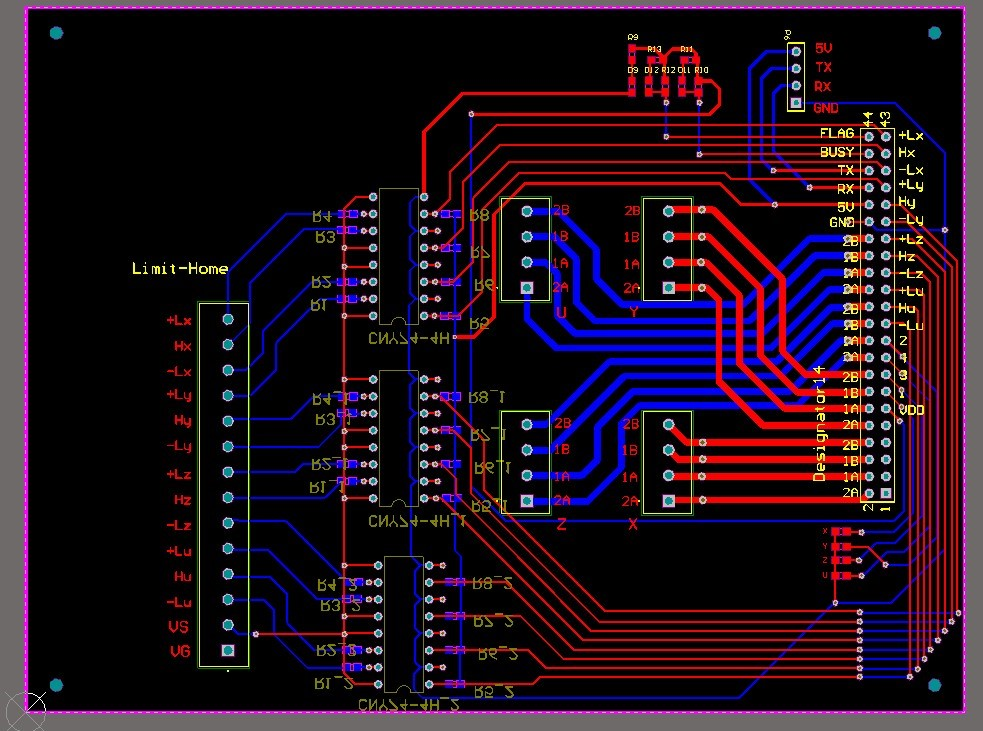  
  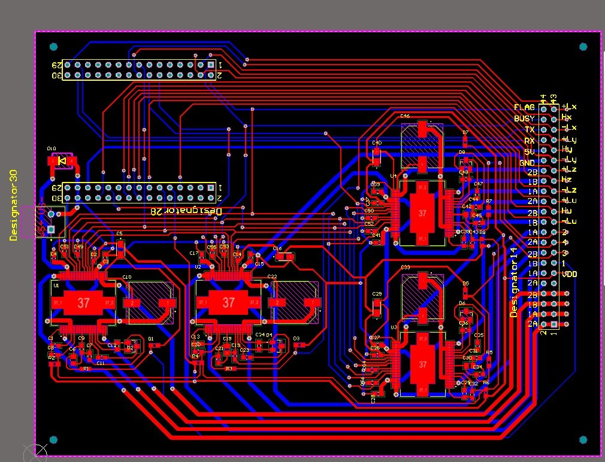  

## References
   1.Fully integrated microstepping motor driver with motion engine and SPI.   
   https://www.st.com/en/motor-drivers/l6470.html  
   2.Two axis stepper motor driver expansion board based on the L6470 for STM32 Nucleo.  
   https://www.st.com/en/ecosystems/x-nucleo-ihm02a1.html  
   3.STM32 Nucleo-64 development board with STM32F401RE MCU, supports Arduino and ST morpho connectivity.    
   https://www.st.com/en/evaluation-tools/nucleo-f401re.html
