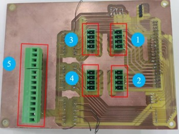
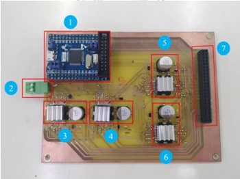

# Application of High-level micro-stepping motor
## Important matters
**This project was jointly completed by @benson20010606 and  Zhiqiang Wang**  

## Project Overview

This project implements a multi-axis micro-stepping motor control system using STM32 microcontrollers and STMicroelectronics motor driver solutions.

The system combines an STM32-based controller, L6470 stepper motor drivers, optical limit-switch sensing, and a PC-based Human-Machine Interface (HMI) developed in C#. User commands are transmitted from the PC to the controller through UART communication, decoded by the STM32, and then forwarded to the motor drivers via SPI to achieve coordinated multi-axis motion control.

To improve system integration and reduce hardware complexity, a custom PCB was designed in Altium Designer to combine the microcontroller, motor drivers, signal isolation circuits, and sensor interfaces into a unified embedded control platform.

## Key Features
- Multi-axis stepper motor position control
- UART communication between PC and embedded controller
- SPI-based motor driver control
- PC-based control interface developed in C#
- Optical limit-switch protection mechanism
- Custom PCB design and hardware integration
- Multi-board architecture for scalable motor control

## Tools & Technologies

- **Programming:** C, C#
- **Microcontroller:** STM32F401RE / STM32F401RCT6
- **Motor Driver:** L6470 (X-NUCLEO-IHM02A1)
- **Communication:** UART, SPI
- **Sensors:** Optical Interrupters, Limit Switches
- **PCB Design:** Altium Designer
- **IDE:** Keil uVision5, Visual Studio 2022
- **HMI:** PC-based Control Interface

## My Contributions
- Developed multi-axis motor control firmware in C on STM32 platforms
- Implemented UART and SPI communication between the PC interface, MCU, and motor drivers
- Designed sensor feedback logic using optical limit switches to constrain motor positions and prevent out-of-range motion
- Developed a PC-based control interface in C# for command transmission and status monitoring
- Designed and customized a PCB based on the X-NUCLEO-IHM02A1 reference design, integrating the STM32 controller, motor drivers, and sensor interfaces into a compact system
- Participated in hardware integration, system validation, and debugging

## Hardware Components

### STM32 Development Board

The STM32F401RE and STM32F401RCT6 platforms were used for firmware development and system integration. The STM32 acts as the central controller responsible for command processing, communication management, and motor control.

  

  

  

### X-NUCLEO-IHM02A1
 
The X-NUCLEO-IHM02A1 is a two axis stepper motor driver expansion board based on the L6470. It provides an affordable and easy-to-use solution for low voltage motor control driving for stepper motors in your STM32 Nucleo project.  

The L6470PD is the main driver chip for the two-axis driver board x-nucleo-ihm02a1. Its primary function is to send pulse signals to control stepper motors. This chip provides an operating voltage of 8-45V, 128 microstep capability, step loss detection, programmable speed profiles, and positioning capability. It also features an SPI module, good power efficiency, and over-temperature protection. Paired with the STM32F401RE development board, it can control up to 8 stepper motors, making it suitable for various applications in multi-axis motor control development.  

  

### optical interrupter

An optical interrupter is a type of sensor with internal components that include an emitter and a receiver placed opposite each other within the same package. When an object passes through the optical interrupter, it interrupts the light path between the emitter and the receiver. If the receiver detects light, it triggers a transistor to maintain a stable state; when no light is detected, it generates a signal. This method is used to achieve the detection function of the optical interrupter.  

In this project, the signal generated by the optical interrupter is used to detect whether a motor exceeds its working range. If the detection point triggers the optical interrupter, the STM32F401RE development board immediately receives the signal and stops the stepper motor from continuing to move.    

  

### optocoupler

An optocoupler is a device that uses light (including visible light and infrared) as a medium to transmit electrical signals between input and output circuits. Its function is to normally isolate the input circuit from the output circuit, and to allow electrical signals to pass through the isolation layer when needed. Optocouplers enable signal transmission between two electrically isolated circuits, ensuring that high voltages between these circuits do not affect each other.  

In this project, the ILQ620GB optocoupler is used as an isolation for limit switch signals. It features 4 sets of optically isolated switches designed for electrical isolation. Its primary function is to block high voltages and voltage transients, preventing these transient voltages from affecting other parts of the circuit.    

  

  

### Stepper motor
 
The system uses micro-stepping stepper motors driven by L6470 motor drivers for precise position and motion control.

    

## Development Process
### Two-axis circuit testing
Before PCB development, a simplified two-axis motor control circuit was assembled and validated using prototype hardware. The prototype was used to verify motor control functions, communication interfaces, and power-system reliability.

    

### Four-axis circuit 

The four-axis motor controller PCB was developed based on the X-NUCLEO-IHM02A1 reference design. The design integrates:

- STM32F401RCT6 controller
- L6470 motor drivers
- Optical isolation circuits
- Limit-switch interfaces
- Power and status monitoring circuits

Due to the use of a milling machine for PCB engraving, vias in the TOP layer and BOTTOM layer require soldering to ensure continuity. Special planning was done for the via design to avoid potential issues with the circuit's functionality later on.

Since the limit switch's power and trigger voltage requirements do not match the system's power supply, optical isolation is needed for electrical isolation. Therefore, an optical isolation circuit was added to the upper board to ensure the proper functionality of the limit switch.
### Upper PCB

    
    

### Lower PCB

    
    

## What This Project Demonstrates
- Embedded firmware development using STM32 microcontrollers
- Integration of MCU-based motor control systems using vendor-provided APIs
- Practical experience with UART and SPI communication protocols
- Hardware-software co-design and system integration
- PCB design and embedded hardware debugging
- Implementation of safety mechanisms for motion-control applications
- Ability to interpret datasheets and configure hardware modules
- Team collaboration across hardware, firmware, and software development

## References
## References

1. [L6470 Motor Drivers](https://www.st.com/en/motor-drivers/l6470.html)

2. [X-NUCLEO-IHM02A1 Expansion Board](https://www.st.com/en/ecosystems/x-nucleo-ihm02a1.html)

3. [NUCLEO-F401RE Development Board](https://www.st.com/en/evaluation-tools/nucleo-f401re.html)